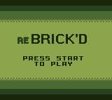
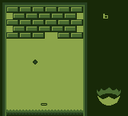

# Nim on GB?

This is an experiment in the vein of [Nim on GBA](https://github.com/hcorion/nim-on-gba) to make Game Boy stuff written in Nim (through GBDK).

 

## What's in here?

- an incomplete set of GBDK bindings (at least they're documented, I guess)
- a custom `nimbase.h`
- two ported GBDK examples (`phys` and `scroller`) and a test of my own
- a buggy Arkanoid clone with a *very* (/s) original name: "Rebrick'd"

## What do I need?

Uses neither Nimble nor Nake, but rather plain ol' Make. :p Though, I want to turn the Makefile into Nimble tasks in the future.

Other than that, you'll of course need [GBDK-2020](https://gbdk-2020.github.io). Make sure to edit the Makefile to point to your GBDK installation.

## Attribution and License Info

* [GBDK-2020](https://github.com/gbdk-2020/gbdk-2020) under [GPLv2 with Linking Exception](https://raw.githubusercontent.com/gbdk-2020/gbdk-2020/develop/licenses/LICENSE_GPLV2_LE)
  * LCC (integrated with GBDK) under the [LCC License](https://raw.githubusercontent.com/gbdk-2020/gbdk-2020/develop/licenses/LICENSE_lcc)
  * (I'm not sure what the GBDK examples are licensed as)
* "Rebrick'd" is based off of the [Unbricked example game](https://gbdev.io/gb-asm-tutorial/part2/getting-started.html) by [Eldred Habert](https://github.com/ISSOtm) and [gb-asm-tutorial contributors](https://github.com/gbdev/gb-asm-tutorial/graphs/contributors), licensed under [CC BY-SA 4.0](https://creativecommons.org/licenses/by-sa/4.0/).
* `incBin` in `gbdk/misc` module originates from [Natu](https://github.com/exelotl/natu), which is under the [Zlib license](https://raw.githubusercontent.com/exelotl/natu/devel/LICENSE)